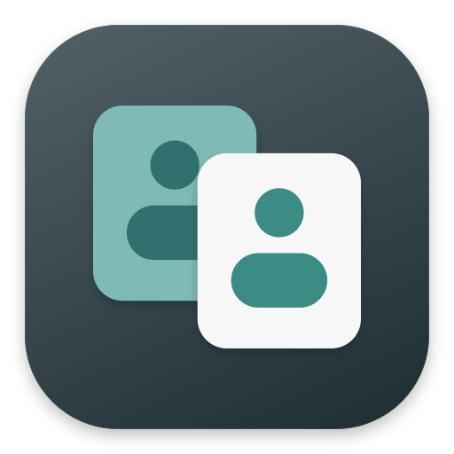
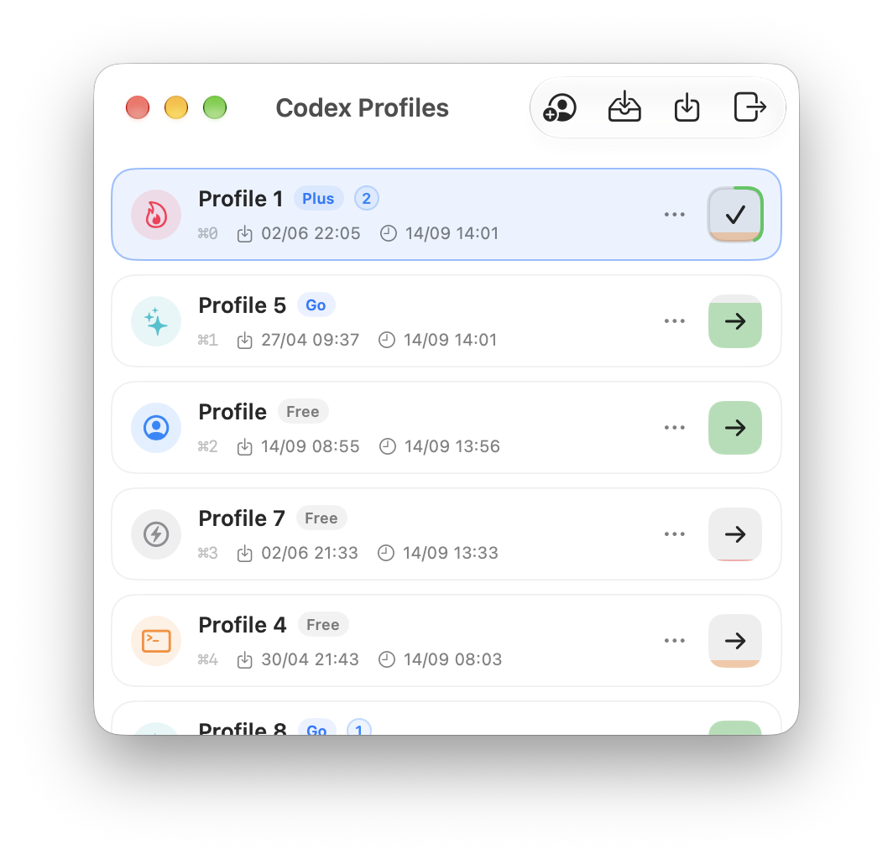

<p align="center">
  
</p>

<h1 align="center">Codex Profiles</h1>

<picture>
  <source media="(prefers-color-scheme: dark)" srcset="screenshots/codex-profiles-dark.png">
  <source media="(prefers-color-scheme: light)" srcset="screenshots/codex-profiles-light.png">
  
</picture>

Native macOS manager for local ChatGPT / Codex profiles.

## Features

- Browser sign-in, profile switching, imports, exports, and local sign-out
- ChatGPT Remote bridge with in-chat account listing and switching (`/accounts`, `/use N`)
- Cached limits, reset counts, and manual or automatic session renewal
- Optional menu bar, ⌘0–9 switching, email privacy, and custom avatars

## Build

```bash
chmod +x Scripts/build_dmg.sh
./Scripts/build_dmg.sh
```

The app and DMG are created in `dist/`.

## Switching profiles from ChatGPT Remote

Pair the ChatGPT app on your phone with this Mac. Relay injects an in-memory `Codex Profiles` project with one `Profiles & Limits` control chat into Remote; it does not create a Codex task or save chat history. Send `/accounts` to see saved profiles, plans, and the latest cached usage readings. Send `/use 2` to switch to the second profile in that list. Profile numbers stay fixed when you switch. Relay generates control replies locally without using model quota. Switching stops the old Codex runtime, restarts ChatGPT on the Mac, and checks the account loaded by the new runtime. A failed switch is reported in the control chat.

ChatGPT Remote does not expose a public API for custom in-chat buttons. Use `/accounts` and `/use N` in the control chat. Usage readings come from the Mac profile cache and include their last updated time. The virtual project is injected first in the project and task lists while Remote is connected.

The selected profile controls which saved Codex account the Mac runtime uses for Remote tasks. The ChatGPT iPhone app remains signed in to its own account; Relay does not change the phone app's login.
