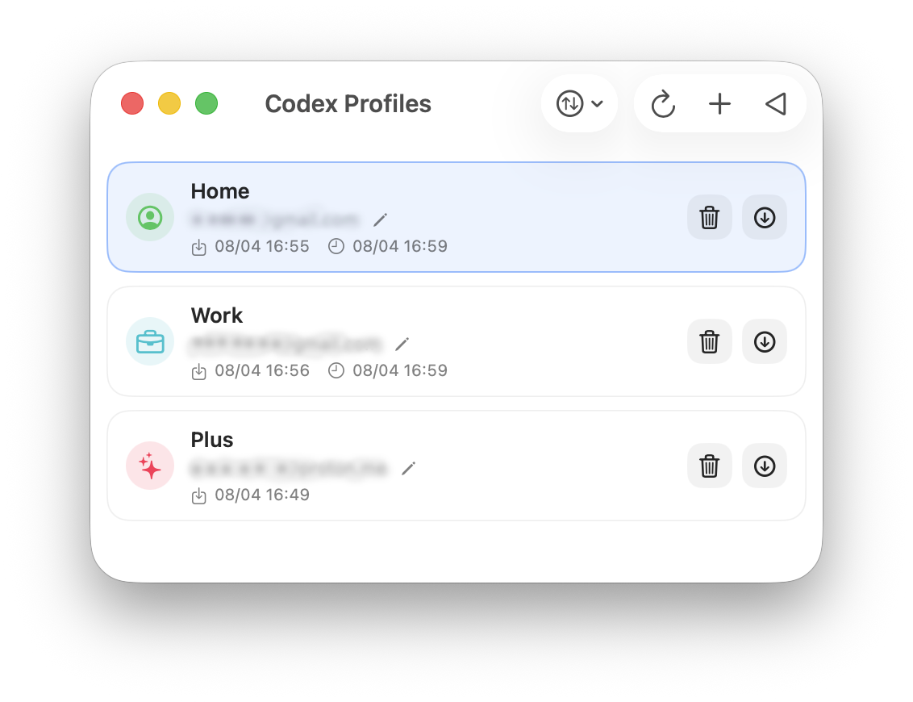

# Codex Profiles

<picture>
  <source media="(prefers-color-scheme: dark)" srcset="screenshots/1b.png">
  <source media="(prefers-color-scheme: light)" srcset="screenshots/1w.png">
  
</picture>

Small native macOS app for saving and loading local Codex profiles.

## Saved files

- `~/.codex/auth.json`

## Features

- Browser sign-in for a new profile without using the Codex app session
- Current profile highlight
- Replace existing profile when the same email is saved again
- Import Codex auth JSON files
- Import and export app backup files
- Logout via the official Codex CLI
- Rename, delete and avatar selection
- Compact toolbar actions

When loading or logging out, the app quits Codex normally, changes only `auth.json`, then opens Codex again.

Profiles saved before recent Codex auth/runtime updates may not work because old sessions can expire or be invalidated by Codex. Recreate those profiles from a currently working Codex login, or import a fresh Codex auth JSON.

## Shortcuts

- `Cmd+N` add current profile
- `Shift+Cmd+N` sign in a new profile
- `Cmd+I` import auth JSON
- `Shift+Cmd+I` import backup
- `Shift+Cmd+E` export all profiles
- `Cmd+R` refresh
- `Shift+Cmd+L` logout

## Build

```bash
chmod +x Scripts/build_app.sh Scripts/build_dmg.sh
./Scripts/build_dmg.sh
```

Artifacts:

- `dist/Codex Profiles.app`
- `dist/Codex Profiles.dmg`
